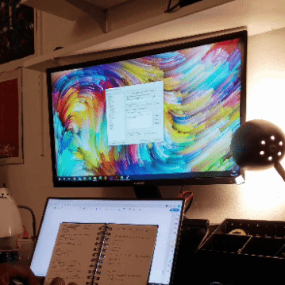
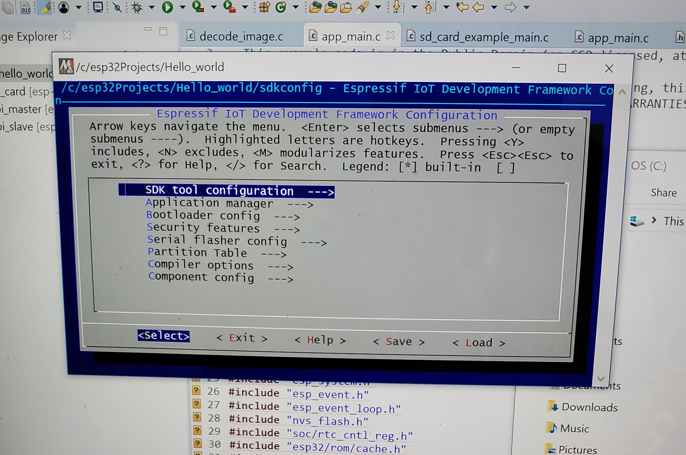
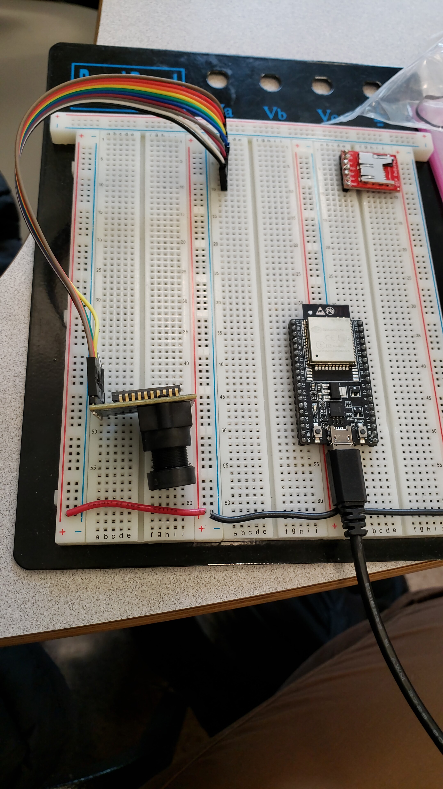
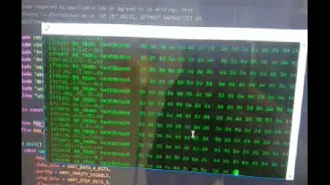
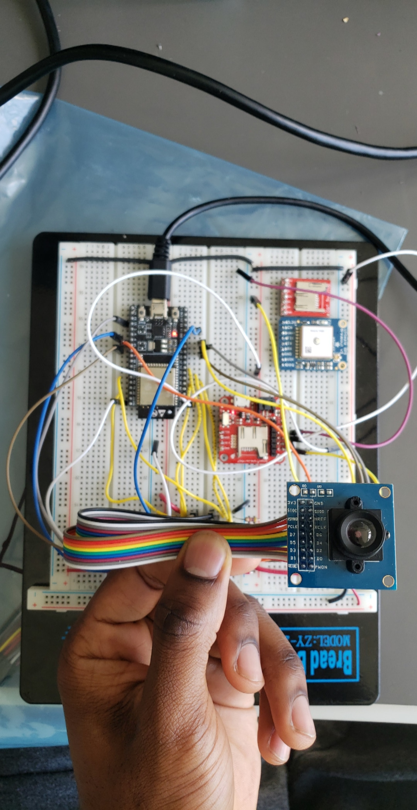
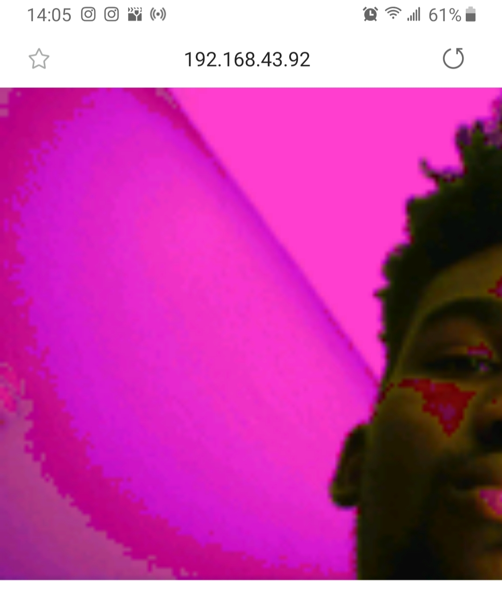

# ESE 350 Project

## Project Overview

We are building a miniature camera that serves as a wearable dietary documentation aid for patients with nutritional needs. The device uploads photos it takes to a webserver where the photos are filtered for food

## Blog
### Week 1 (4/8/19)

A large amount of our time was dominated by learning to use and configure our ESP32.

 We found ourselves embroiled in setting up low-level espressif software, OS environment variables, resourse paths and more in an effort to be able to build and flash our C/C++ code which was dependent on the [esp-idf libraries](https://github.com/espressif/esp-idf). After much effort & error, we managed to configure our laptops to interface with the ESP32 and run a simple "Hello World" script.

Up until this point we had been using an ArduCam which had all its support and libraries based on the arduino library. We spent a lot of time writing our own libraries in pure C but to no avail. This major time consumption lead us to shift focus in week 2.

**Circuit End of Week 1**

### Week 2 (4/15/19)

We then went on to learn how to use the UART Rx/Tx pins to interface a Razor IMU with the ESP32. After learning our device pinout (as there seem to be a couple of ESP32 versions out there) we were able to read orientation data straight from our IMU which will be vital for us in implementing our 'deep sleep' mode.

We switched cameras from ArduCam to a much more adaptable OV7670 w/out FIFO and finally managed to process our image! This camera only has minimal dependencies on the Arduino library as opposed tothe ArduCam. We are still awaiting the shipment of an ESP32 dedicated camera.

We setup a hotspot on a phone (as a user would) and connected our system to the network. We relayed the image to  a locally hosted webserver for now. We hope to pull the image for processing using dedicated machine learning libraries to determine whether the patient has captured an image of food or not.

**Circuit End of Week 1**

While we were able to successfully capture images with using DMA, the images came out discoloured. We postulate this could be happening for a few reasons which we've narrowed down to the following:

- **Lack of FIFO:** from what we've read online, using the OV7670 without FIFO does not produce the best picture quality
- **Long Wires:** We have a very long path of wires until they finally reach their destination. They all could be acting as antennas. Shortening these connections might increase image quality.
- **Damaged Module:** This camera has been circulating Detkin for quite some time.

In any case, we have ordered an ESP32 dedicated camera that hopefully we will be able to integrate soon.

### Week 3 (4/22/19)

### Support or Contact

Having trouble with Pages? Check out our [documentation](https://help.github.com/categories/github-pages-basics/) or [contact support](https://github.com/contact) and we’ll help you sort it out.
