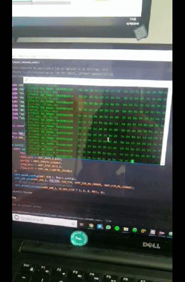

# ESE 350 Project

## Project Overview

We are building a miniature camera that serves as a wearable dietary documentation aid for patients with nutritional needs. The device uploads photos it takes to a webserver where the photos are filtered for food

## Blog
### Week 1 (4/8/19)

A large amount of our time was dominated by learning to use and configure our ESP32. We found ourselves embroiled in setting up low-level espressif software, OS environment variables, resourse paths and more in an effort to be able to flash C/C++ code to our MCU. After much effort & error, we managed to configure our laptops to interface with the ESP32 and run a simple "Hello World" script.

We then went on to learn how to use the UART Rx/Tx pins to interface a Razor IMU with the ESP32. After learning our device pinout (as there seem to be a couple of ESP32 versions out there) we were able to read orientation data straight from our IMU which will be vital for us in implementing our 'deep sleep' mode.

### Week 2 (4/15/19)

### Week 3 (4/22/19)

### Support or Contact

Having trouble with Pages? Check out our [documentation](https://help.github.com/categories/github-pages-basics/) or [contact support](https://github.com/contact) and we’ll help you sort it out.
